# IBM DevOps & Software Engineering — Proof of Work (PoW)
**[Specialisation from Coursea Link](https://www.coursera.org/professional-certificates/devops-and-software-engineering)**

**John Waldron — “IrishBitcoin Man”**

Bridging the past to meet the future: taking enterprise messaging/MQ discipline into
cloud-native, test-first, automated delivery with transparent proof-of-work you can inspect.

- 🔗 **Coursera Certificate URL:** <!-- update if needed -->
  [Coursea Cert URL](https://coursera.org/verify/professional-cert/70EALTLKZVDV)
- 🧵 **LinkedIn post:** <!-- add your public post URL -->
  [LINKEDIN_POST_URL](https://www.linkedin.com/posts/johndtwaldron_devops-ci-kubernetes-activity-7377097670714163201-x6L3?utm_source=share&utm_medium=member_desktop&rcm=ACoAABU-Qp4BtdglKBjC9FI_b6dDeW8j4nZl2Rs)
- 🔗 **Coursera Certificate.PDF:** <!-- update if needed -->
  

---

## TL;DR — What I built & automated

- 🧩 **Accounts microservice** (Python/Flask) packaged as a container.
- ☸️ **Kubernetes/OpenShift** deployment with a public **Route + TLS**.
- 🤖 **Tekton CD pipeline**: `clone → lint → tests → buildah image → deploy`
  - Shared **PVC** workspace
  - **GitHub auth** via Kubernetes `Secret`
- 🧪 **Tests**: unit & API (nose) with coverage (lab run: *24 tests, ~94%*).
- 🔒 **Security**: added security headers at the Route; ran **Bandit** and **Safety**.
- 📋 **Workflow**: feature branch → PR → merge → rollout; everything in Git.

Key Links to project repos involved from each course row and section below.

---

## Curriculum (15 Courses)

> Table shows Course names, short outcomes, and links to work done:
> **Course**, **Course URL**, **Repo/PoW**, **Badge/Cert**.

| # | Course (linked) | Practiced / delivered (links to repo if present) | Badge |
|---|---|---|---|
| 1 | [**Introduction to DevOps**](https://www.coursera.org/learn/intro-to-devops?specialization=devops-and-software-engineering) | DevOps culture; CALMS; value streams; SLOs/SLIs | [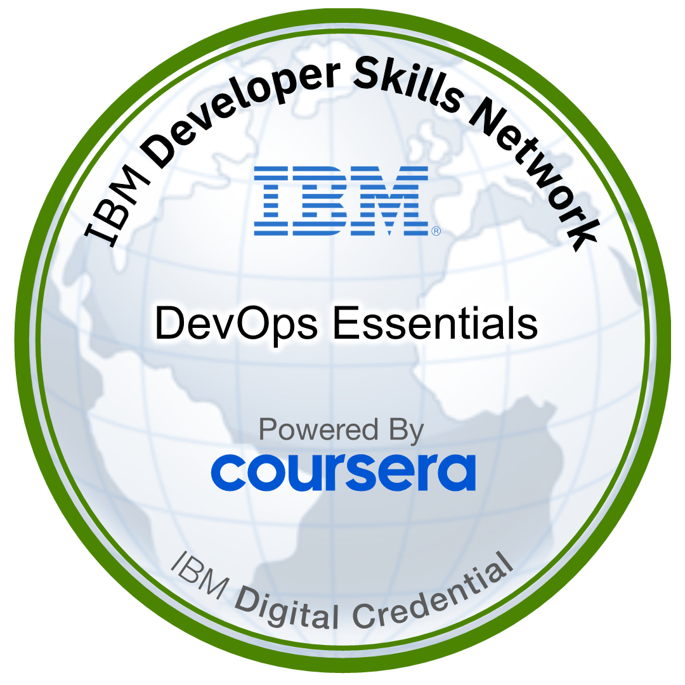](JDW-Badges/1.devops-essentials.2.png) |
| 2 | [**Introduction to Cloud Computing**](https://www.coursera.org/learn/introduction-to-cloud?specialization=devops-and-software-engineering) | IaaS/PaaS/SaaS; regions/zones; shared responsibility | [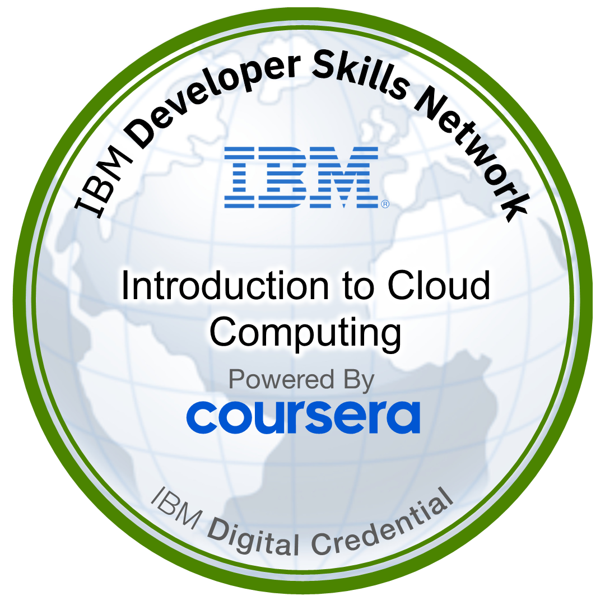](JDW-Badges/2.introduction-to-cloud-computing.png) |
| 3 | [**Introduction to Agile Development and Scrum**](https://www.coursera.org/learn/agile-development-and-scrum?specialization=devops-and-software-engineering) | Scrum roles/artifacts; user stories; Kanban | [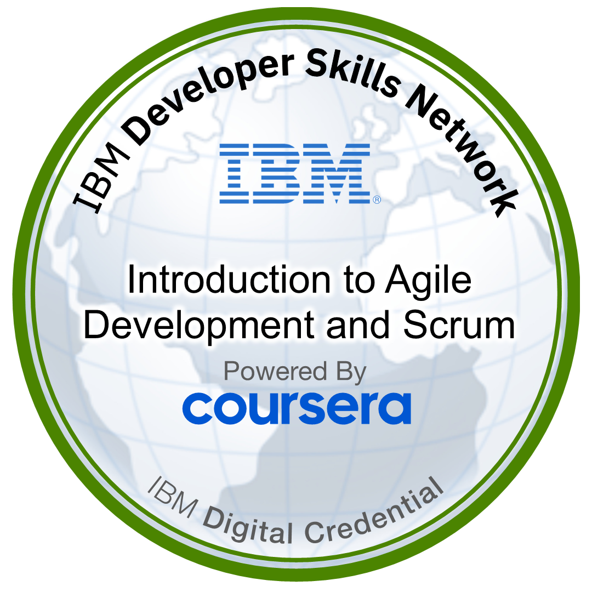](JDW-Badges/3.introduction-to-agile-development-and-scrum.png) |
| 4 | [**Introduction to Software Engineering**](https://www.coursera.org/learn/introduction-to-software-engineering?specialization=devops-and-software-engineering) | Requirements → design → testing; SDLC trade-offs | [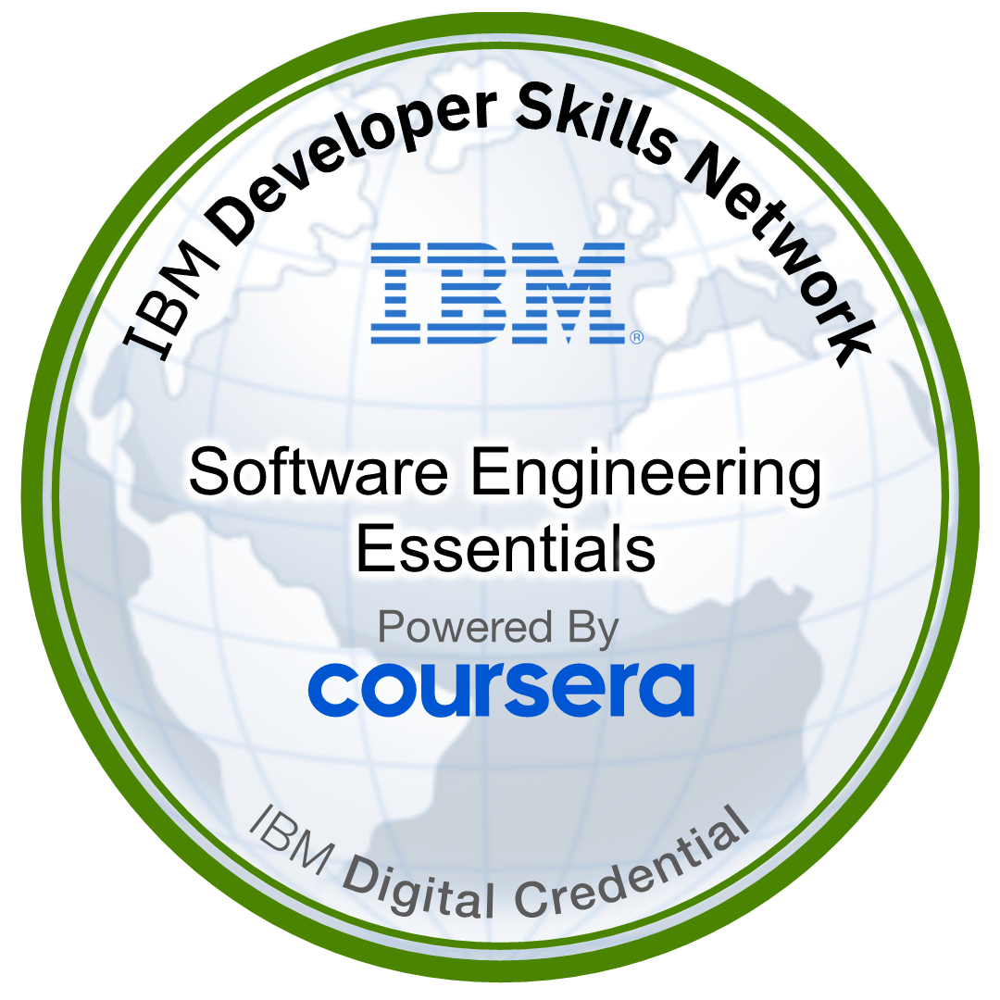](JDW-Badges/software-engineering-essentials.png) |
| 5 | [**Getting Started with Git and GitHub**](https://www.coursera.org/learn/getting-started-with-git-and-github?specialization=devops-and-software-engineering) | [Branch/PR flows; protected branches; reviews](https://github.com/johndtwaldron/jbbmo-Introduction-to-Git-and-GitHub) | [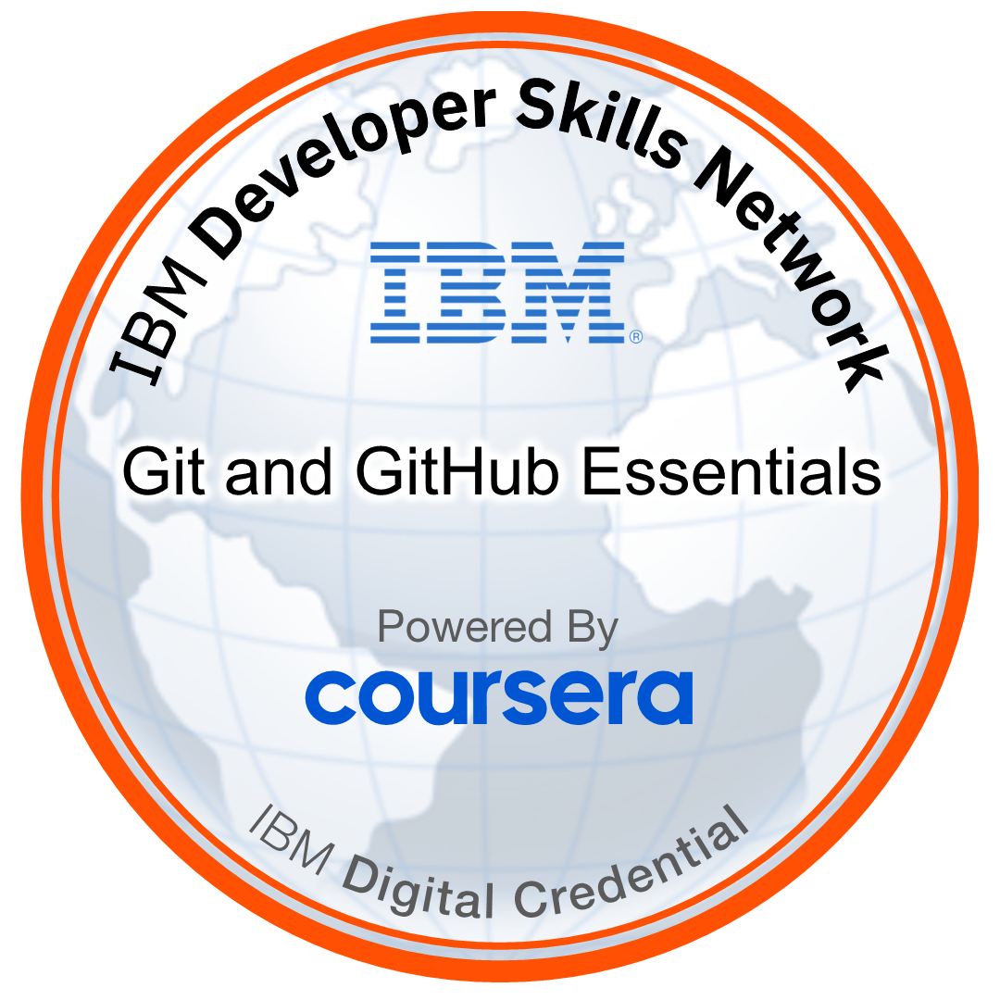](JDW-Badges/5.git-and-github-essentials.png) |
| 6 | [**Hands-on Intro to Linux Commands & Shell Scripting**](https://www.coursera.org/learn/hands-on-introduction-to-linux-commands-and-shell-scripting?specialization=devops-and-software-engineering) | CLI; pipes/filters; Bash automation | [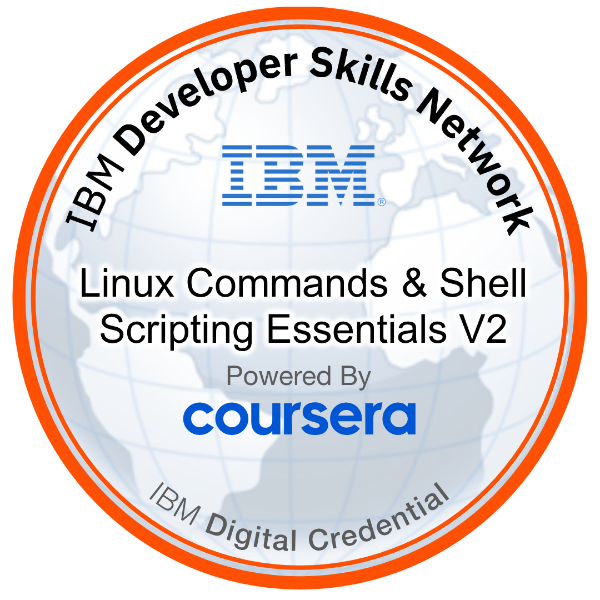](JDW-Badges/6.linux-commands-shell-scripting-essentials-v2.png) |
| 7 | [**Python for Data Science, AI & Development**](https://www.coursera.org/learn/python-for-applied-data-science-ai?specialization=devops-and-software-engineering) | Python fundamentals; packaging; venvs | [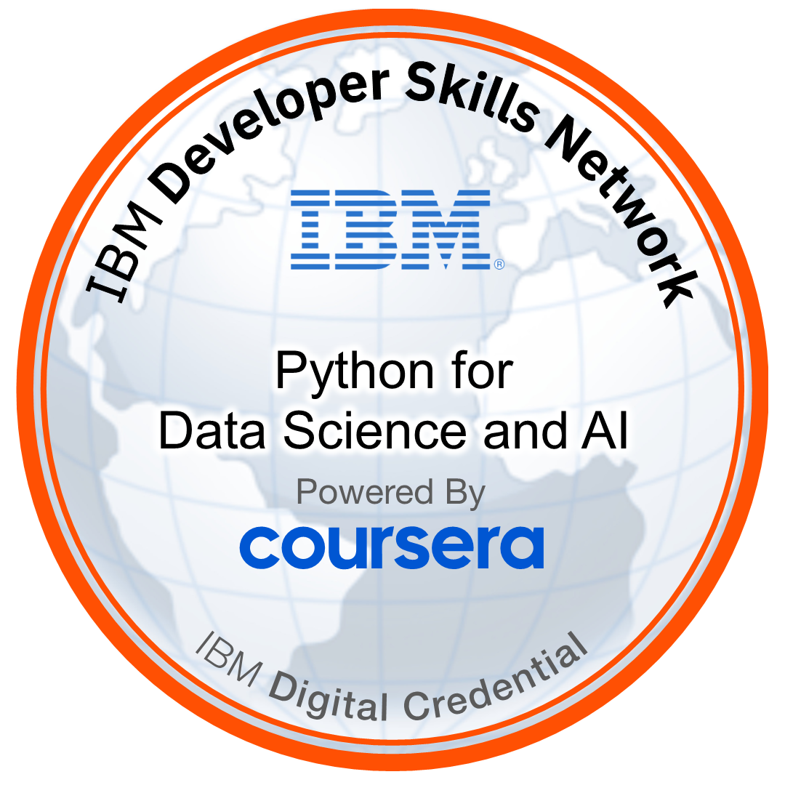](JDW-Badges/7.python-for-data-science-and-ai.png) |
| 8 | [**Developing AI Applications with Python and Flask**](https://www.coursera.org/learn/python-project-for-ai-application-development?specialization=devops-and-software-engineering) | [Flask blueprints; config; APIs](https://github.com/johndtwaldron/oaqjp-final-project-emb-ai) |  |
| 9 | [**Intro to Containers with Docker, Kubernetes & OpenShift**](https://www.coursera.org/learn/ibm-containers-docker-kubernetes-openshift?specialization=devops-and-software-engineering) | [Dockerfiles; images; Deployments/Services; Routes](https://github.com/johndtwaldron/IBM-guestbook-k8s-lab-JDW-PoW) |  |
| 10 | [**App Dev using Microservices & Serverless**](https://www.coursera.org/learn/applications-development-microservices-serverless-openshift?specialization=devops-and-software-engineering) | [Boundaries; REST; eventing; FaaS fit](https://github.com/johndtwaldron/IBM.App.Dev.Microserv.serverless-JDW-POW) | [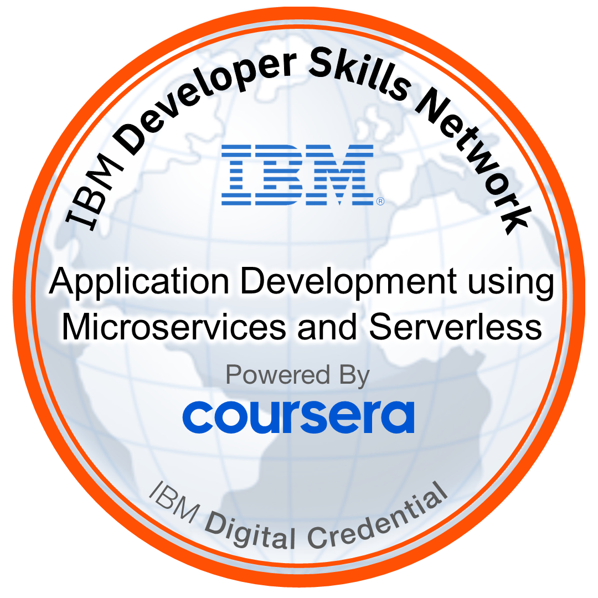](JDW-Badges/10.application-development-using-microservices-and-ser.png) |
| 11 | [**Intro to Test & Behavior-Driven Development**](https://www.coursera.org/learn/test-and-behavior-driven-development-tdd-bdd?specialization=devops-and-software-engineering) |  [Nose/pytest; BDD mindset; coverage](https://github.com/johndtwaldron/IBM-tdd-bdd-final-project-JDW-PoW) | [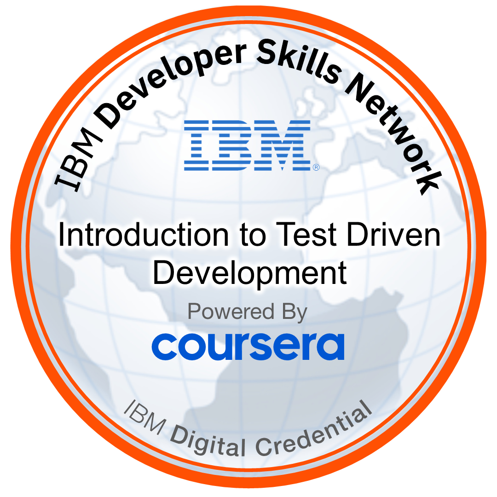](JDW-Badges/11.introduction-to-test-driven-development.1.png) |
| 12 | [**Continuous Integration & Continuous Delivery (CI/CD)**](https://www.coursera.org/learn/continuous-integration-and-continuous-delivery-ci-cd?specialization=devops-and-software-engineering) | Pipelines; artifact promotion; approvals | [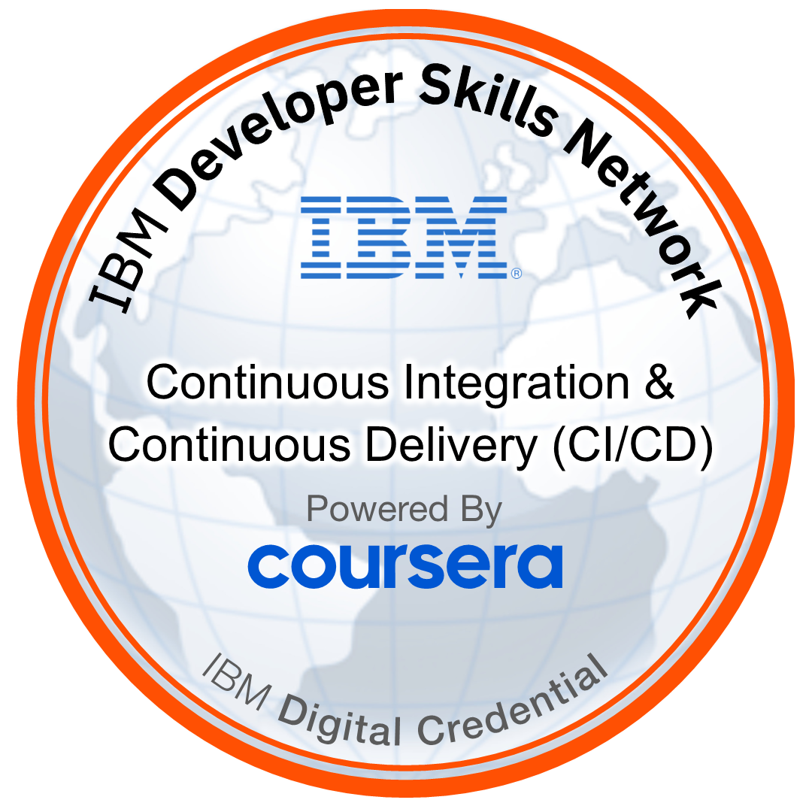](JDW-Badges/12.continuous-integration-continuous-delivery-ci-cd.1.png) |
| 13 | [**App Security for Developers & DevOps Pros**](https://www.coursera.org/learn/application-security-for-developers-devops?specialization=devops-and-software-engineering) | [Threat modeling; SAST/DAST; secrets; headers/CORS](https://github.com/johndtwaldron/graphy_server) | [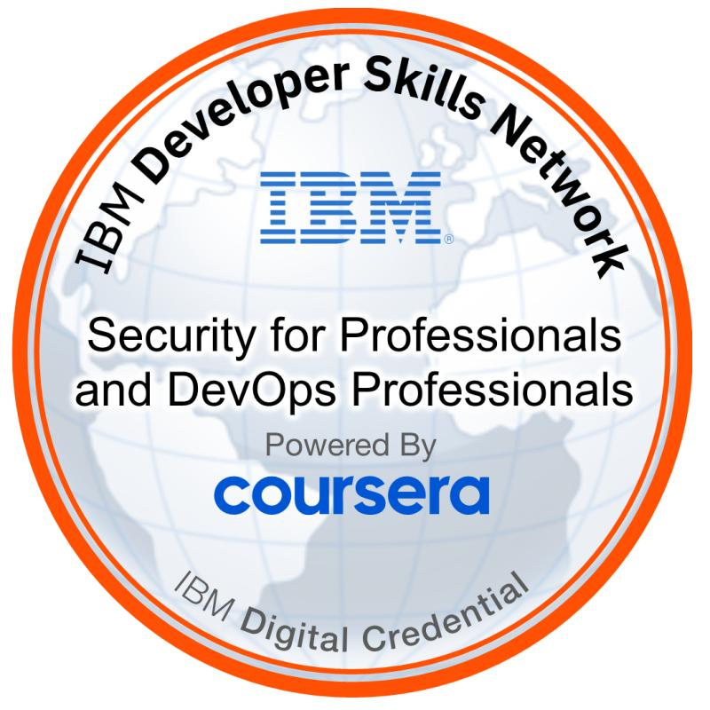](JDW-Badges/13.devsecops.1757176289358.jpeg) |
| 14 | [**Monitoring & Observability for DevOps**](https://www.coursera.org/learn/monitoring-and-observability-for-development-and-devops?specialization=devops-and-software-engineering) | Logs/metrics/traces; alerts; SLO dashboards | [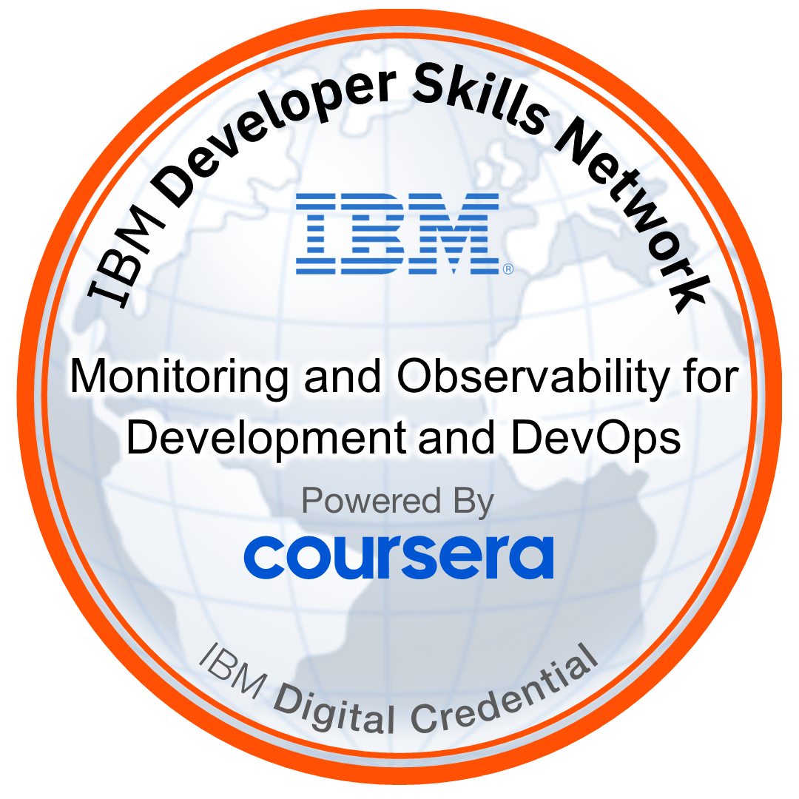](JDW-Badges/14.monitoring-and-observability-for-development-and-de.png) |
| 15 | [**DevOps Capstone Project**](https://www.coursera.org/learn/devops-capstone-project?specialization=devops-and-software-engineering) | [End-to-end PoW: microservice + K8s + Tekton CD](https://github.com/johndtwaldron/aolwx-devops-capstone-JDW-PoW) | [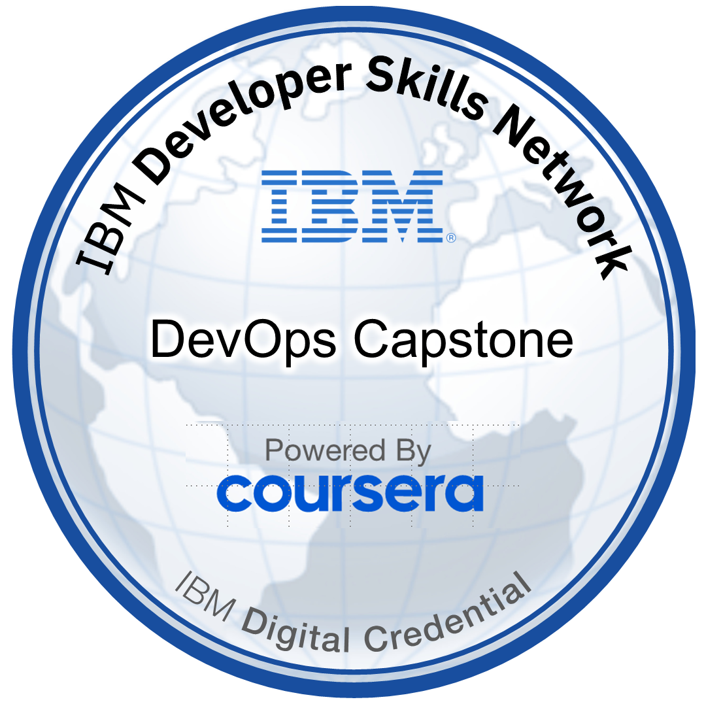](JDW-Badges/15.devops-capstone.png) |

> _The list above mirrors the 15-course sidebar shown on the certificate._

---

  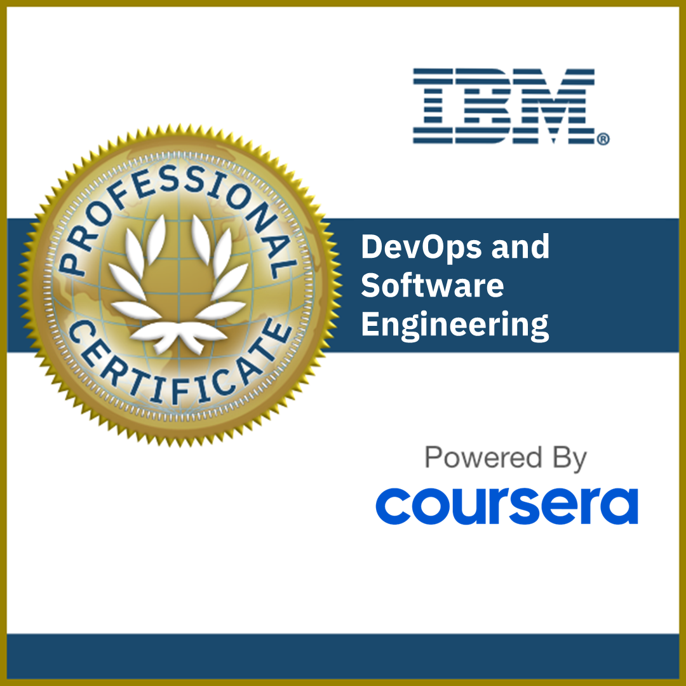
  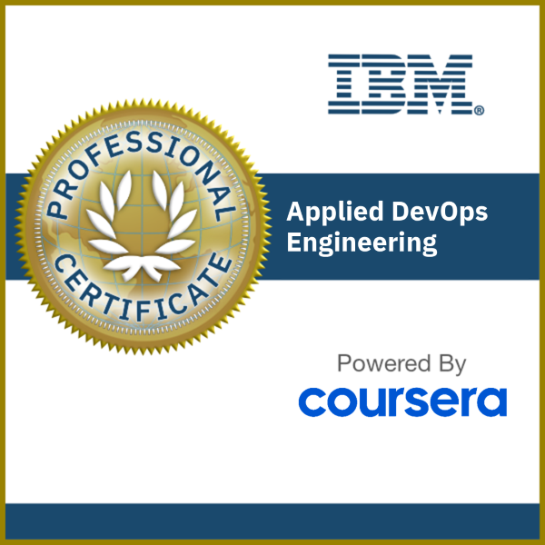
## Cert PDF From Credly => 
  [📄 IBM DevOps & Software Engineering — Credly Cert (PDF)](JDW-Certs/0.IBMDesign20250926-32-l73wo5.pdf)
