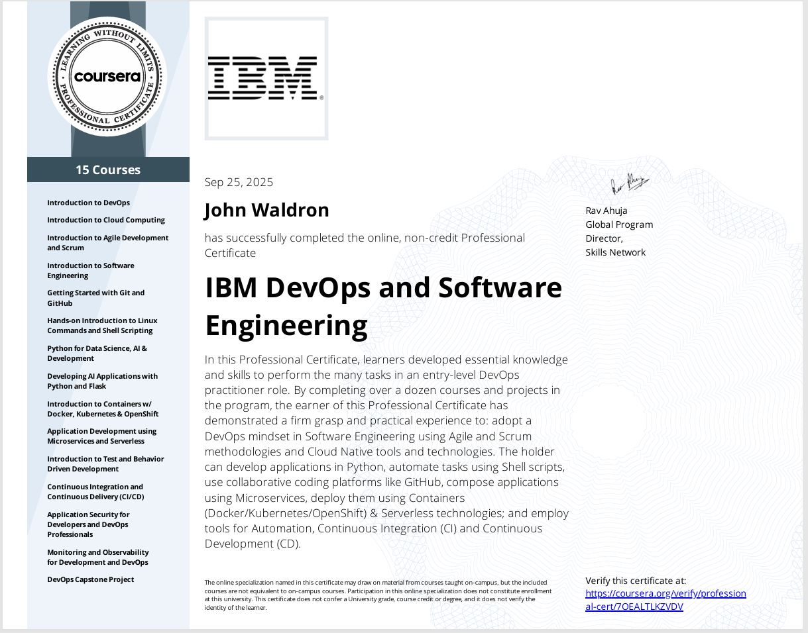

# IBM DevOps & Software Engineering — Proof of Work (PoW)

**John Waldron — “IrishBitcoin Man”**

Bridging the past to meet the future: taking enterprise messaging/MQ discipline into
cloud-native, test-first, automated delivery with transparent proof-of-work you can inspect.

- 🔗 **Coursera Certificate URL:** <!-- update if needed -->
  [Coursea Cert URL](https://coursera.org/verify/professional-cert/70EALTLKZVDV)
- 🧵 **LinkedIn post:** <!-- add your public post URL -->
  [LINKEDIN_POST_URL](https://www.linkedin.com/posts/johndtwaldron_devops-ci-kubernetes-activity-7377097670714163201-x6L3?utm_source=share&utm_medium=member_desktop&rcm=ACoAABU-Qp4BtdglKBjC9FI_b6dDeW8j4nZl2Rs)
- 🔗 **Coursera Certificate.PDF:** <!-- update if needed -->
  

---

## TL;DR — What I built & automated

- 🧩 **Accounts microservice** (Python/Flask) packaged as a container.
- ☸️ **Kubernetes/OpenShift** deployment with a public **Route + TLS**.
- 🤖 **Tekton CD pipeline**: `clone → lint → tests → buildah image → deploy`
  - Shared **PVC** workspace
  - **GitHub auth** via Kubernetes `Secret`
- 🧪 **Tests**: unit & API (nose) with coverage (lab run: *24 tests, ~94%*).
- 🔒 **Security**: added security headers at the Route; ran **Bandit** and **Safety**.
- 📋 **Workflow**: feature branch → PR → merge → rollout; everything in Git.

Key Links to project repos involved from each course row and section below.

---

## Curriculum (15 Courses)

> Table shows Course names, short outcomes, and links to work done:
> **Course**, **Course URL**, **Repo/PoW**, **Badge/Cert**.

| # | Course | What I practiced / delivered | Course URL | Repo / PoW | Badge / Cert |
|---|---|---|---|---|---|
| 1 | **Introduction to DevOps** | DevOps culture, CALMS, value streams, SLOs/SLIs | <ADD_LINK> | <ADD_REPO_OR_NOTES> | [DevOps-Badge-PNG](JDW-Badges/introduction-to-devops.png) |
| 2 | **Introduction to Cloud Computing** | IaaS/PaaS/SaaS, regions/zones, shared responsibility | <ADD_LINK> | <ADD_REPO_OR_NOTES> | [Cloud-Badge-PNG](JDW-Badges/introduction-to-cloud-computing.png) |
| 3 | **Introduction to Agile Development and Scrum** | Scrum roles/artifacts, user stories, Kanban flows | <ADD_LINK> | <ADD_REPO_OR_NOTES> | [Agile-Badge-PNG](JDW-Badges/introduction-to-agile-development-and-scrum.png) |
| 4 | **Introduction to Software Engineering** | Requirements → design → testing; SDLC trade-offs | <ADD_LINK> | <ADD_REPO_OR_NOTES> | [SoftEng-Badge-PNG](JDW-Badges/software-engineering-essentials1.png) |
| 5 | **Getting Started with Git and GitHub** | Branch/PR flows, protected branches, code reviews | <ADD_LINK> | [Git-Intro-JDW-REPO](https://github.com/johndtwaldron/jbbmo-Introduction-to-Git-and-GitHub) | <ADD_BADGE> |
| 6 | **Hands-on Intro to Linux Commands & Shell Scripting** | CLI, pipes/filters, Bash automation | <ADD_LINK> | <ADD_REPO_OR_NOTES> | [Linux-Badge-PNG](JDW-Badges/hands-on-intro-to-linux-commands-and-shell-scripting.png) |
| 7 | **Python for Data Science, AI & Development** | Python fundamentals, packaging, venvs | <ADD_LINK> | <ADD_REPO_OR_NOTES> | [PyDS-Badge-PNG](JDW-Badges/python-for-data-science-ai-and-development.png) |
| 8 | **Developing AI Applications with Python and Flask** | Flask app structure, blueprints, config, APIs | <ADD_LINK> | [Final-project-ai-JDW-REPO](https://github.com/johndtwaldron/oaqjp-final-project-emb-ai) | [Flask-AI-Badge-PNG](JDW-Badges/python-project-for-ai-and-application-development.png) |
| 9 | **Introduction to Containers with Docker, Kubernetes & OpenShift** | Dockerfiles, images, Pods/Deployments/Services, Routes | <ADD_LINK> | [K8-JDW-REPO](https://github.com/johndtwaldron/IBM-guestbook-k8s-lab-JDW-PoW) | [K8-Badge-PNG](JDW-Badges/containers-kubernetes-essentials1.png) |
| 10 | **Application Development using Microservices & Serverless** | Microservice boundaries, REST, eventing, FaaS fit | <ADD_LINK> | [Microserv-JDW-REPO](https://github.com/johndtwaldron/IBM.App.Dev.Microserv.serverless-JDW-POW) | [Flask-AI-Badge-PNG](JDW-Badges/python-project-for-ai-and-application-development.png) |
| 11 | **Introduction to Test & Behavior-Driven Development** | Nose/pytest, BDD mindset, coverage | <ADD_LINK> | [tdd-bdd-JDW-Repo](https://github.com/johndtwaldron/IBM-tdd-bdd-final-project-JDW-PoW) | [TDD-Badge-PNG](JDW-Badges/introduction-to-test-driven-development.1.png) |
| 12 | **Continuous Integration & Continuous Delivery (CI/CD)** | Pipelines, artifact promotion, approvals | <ADD_LINK> | <ADD_REPO_OR_NOTES> | [DevSecOps-Badge-PNG](JDW-Badges/application-security-for-developers-and-devops.png) |
| 13 | **Application Security for Developers & DevOps Professionals** | Threat modeling, SAST/DAST, secrets, headers/CORS | <ADD_LINK> | [DevSecOps-JDW-REPO](https://github.com/johndtwaldron/graphy_server) | [DevSecOps-Badge-PNG](JDW-Badges/application-security-for-developers-and-devops.png) |
| 14 | **Monitoring & Observability for DevOps** | Logs/metrics/traces, alerts, SLO-based dashboards | <ADD_LINK> | <ADD_REPO_OR_NOTES> | [Observability-Badge-PNG](JDW-Badges/monitoring-and-observability-for-development-and-de.png) |
| 15 | **DevOps Capstone Project** | End-to-end PoW: microservice + K8s + Tekton CD | <ADD_LINK> | [DevOps-Capstone-JDW-Repo](https://github.com/johndtwaldron/aolwx-devops-capstone-JDW-PoW) | [Capstone-Badge-PNG](JDW-Badges/devops-capstone.png) |

> _The list above mirrors the 15-course sidebar shown on the certificate._

---
